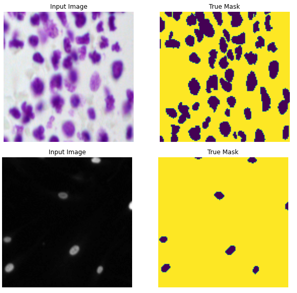
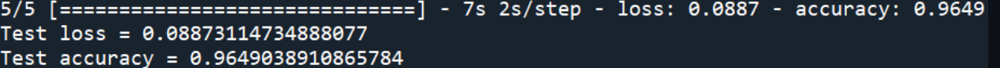
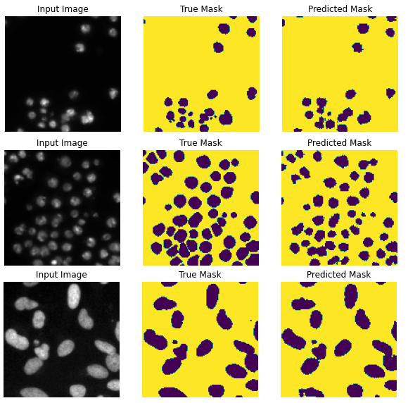

# Exercise-4-Cell-Nuclei-Image-Segmentation
## Summary
The aim of the project is to detect cell nuclei from biomedical images effectively. As cell nuclei vary in shapes and sizes, semantic segmentation 
proves to be the best approach to detect them. A deep learning model is trained and deployed for this task. 
The model is trained with the well known [2018 Data Science Bowl dataset](https://www.kaggle.com/c/data-science-bowl-2018).

## IDE and Framerowk
The project is built with Spyder as the main IDE. The main frameworks used in this project are TensorFlow, Numpy, Matplotlib, OpenCV and Scikit-learn.

## Methodology
The methodology is inspired by a documentation available in the official TensorFlow website. (https://www.tensorflow.org/tutorials/images/segmentation).

### Input Pipeline
The dataset files contains a train folder for training data and test folder for testing data, in the format of images for inputs and image masks for the labels. 
The input images are preprocessed with feature scaling. 
The labels are preprocessed such that the values are in binary of 0 and 1. No data augmentation is applied for the dataset. 
The train data is split into train-validation sets, with a ratio of 80:20. 
Sample image of input and mask as shown below.

## Results
The model is evaluated with test data, which is shown in figure below.

Some predictions are also made with the model using wild test data. The actual output masks and prediction masks are shown in figures below.

Overall, the model is capable of segmenting the cell neuclei with an excellent accuracy.
